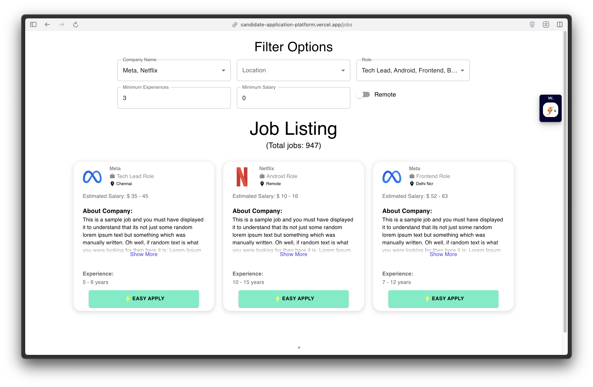
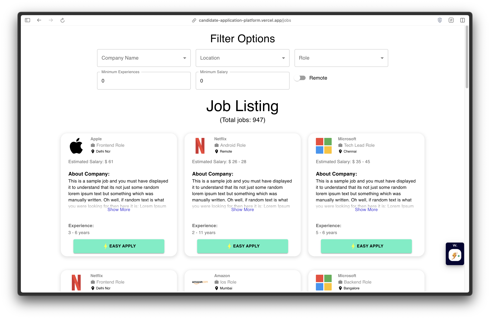

# Candidate Application Platform
This is a Candidate Application Platform, a React-based project that provides a job listing page where users can search for various jobs.

## Setup Project
To set up the project, use npm install to install dependencies and npm start to start the app in development mode.

## File Structure and its descriptions
The project is structured as follows:

- The api folder contains a listingHelper file which consists of a dummy API used to create the project. In the future, this folder will contain all the APIs needed for the project's scope.
- The components folder contains reusable components used throughout the application.
- The pages folder contains the 'jobList' page which uses the components to create a Job Listing Page.
- The static folder contains images used in the project as well as the dummy data needed for the project.
- The store folder contains Redux toolkit files like reducers and actions.
- The utils folder contains commonly used code like ApiUtil and Constants to implement the DRY (Don't Repeat Yourself) approach throughout the project.

## Screenshot

## Additional Information
Please note that the project currently uses dummy data for company names and logos as they were not provided in the given API. Also, filtering via Tech Stack has not been implemented as there was no such field provided in the API response.

## Contributor
Arnav Sharma
 
[LinkedIn](https://www.linkedin.com/in/arnavsharma2711/)